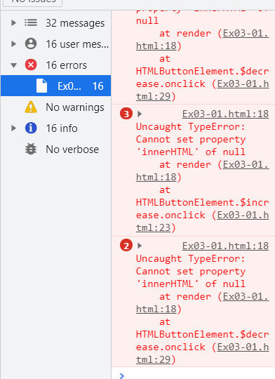

# 자바스크립트 실행 환경

모든 브라우저는 자바스크립트 엔진을 내장하고 있다. Node.js도 마찬가지.

하지만 주의해야 할 점은, 브라우저와 노드는 용도가 다르다. 브라우저는 JS를 실행해, 웹페이지를
브라우저 화면에 렌더링하는 것이 주된 목적이지만,
Node.js는 브라우저 외부에서 자바스크립트 실행 환경을 제공하는 것이 주된 목적이다.

그렇기 때문에 ECMAScript 이외에 각각 추가로 제공하는 기능은 호환되지 않는다.

브라우저는 ECMAScript와 DOM, BOM, Canvas, XMLHttpRequest, fetch, requestAnimationFrame, Webstorage, Web Component, WEb Worker 같은클라이언트 사이드 Web API를 지원하지만,
Node.js는 클라이언트 사이드 Web API를 지원하지 않고 고유의 API를 지원한다.

## 크롬 개발자도구

크롬 브라우저가 제공하는 개발자도구(DevTools)는 웹 애플리케이션 개발에 필수적인 강력한 도구다.
개발자 도구는 브라우저에 기본 내장되어 있으므로, 별도로 설치할 필요가 없다.

자주 사용하는 개발자 도구의 기능은 Elements, Console, Sources, NetWork, Application 이다
- Elements : 로딩된 웹페이지의 DOM과 CSS를 편집해서 렌더링 뷰를 확인해 볼 수 있다. 단 편집한 내용이 저장되지 않기 때문에 웹페이지가 의도된 대로 렌더링 되지 않았다면, 해당 패널로 유용한 힌트를 얻을 수 있다.
- console : 로딩된 웹페이지의 에러를 확인하거나 자바스크립트 소스코드에 작성한 console.log 메서드의 실행결과를 확인할 수 있다.
- Sources : 로딩된 웹페이지의 자바스크립트 코드를 디버깅 할 수 있다.
- Network : 로딩된 웹페이지의 관련된 request 정보와 성능을 확인 할 수 있다.
- Application : 웹 스토리지, 세션, 쿠키를 확인하고 관리 할 수 있다.

## 콘솔

개발자 도구의 콘솔은 자바스크립트 코드에서 에러가 발생해 정상적으로 동작하지 않을 때 가장 우선적으로 살펴봐야 할 곳이다. 열어둔 상태에서 개발하는 것이 Best

## 브라우저에서 자바스크립트 실행

책에 있는 Ex03-01 html을 브라우저로 실행하면 해당하는 에러메시지가 출력된다.

## 디버깅

검사 -> Source 패널로 이동해서 브레이크포인트를 잡고 버튼을 클릭하면
에러가 발생한 위치에 빨간색 밑줄이 표시된다.
확인 완료 후 예제 ex03-01의 소스코드중 counter-x를 counter로 변경해주면 정상적으로 코드가 실행되었다.

## Node.js

간단한 웹 애플리케이션은 브라우저만으로도 개발할 수 있지만, 프로젝트의 규모가 커짐에 따라 React,Angular,Lodash같은 프레임워크 또는 라이브러리를 도입하거나
Babel,Webpack 등 여러가지 도구를 사용할 필요가 있다. 이때 node.js와 npm이 필요하다.

- Node.js는 크롬 V8 자바스크립트 엔진으로 빌드된 자바스크립트 런타임 환경.
- npm은 자바스크립트 패키지 매니저. node.js에서 사용할 수 있는 모듈들을 패키지화해서 모아둔 저장소 역할과 패키지 설치 및 관리를 위한 CLI를 제공한다.

## Extensions(확장 플러그인) 설치
- Code Runner : VS Code 내에서 바로 소스를 돌려보기 위해 설치함.
- Live Server : html 소스코드를 수정할 때마다 수정사항을 브라우저에 바로 반영해주기 때문에 매우 편리하다.