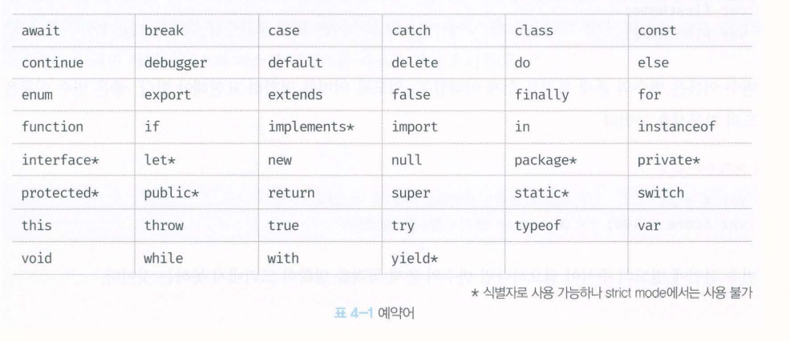

# 변수란?

사람이 10+20의 식을 계산하려면 10,20, + 기호의 의미를 알고 있어야하며, 식의 의미도 해석 할 수 있어야 한다.

자바스크립트 엔진도 사람과 유사하게 위 자바스크립트 코드를 실행한다.
먼저 10, 20, +라는 기호(literal,operator)의 의미를 알고 있어야 하며, 10+20이라는 식(expression)의 의미도 해석(parsing)할 수 있어야한다.

컴퓨터는 CPU를 사용해 연산하고, 메모리를 사용해 데이터를 기억한다.

메모리는 데이터를 저장할 수 있는 메모리 셀의 집합체. 메모리 셀 하나의 크기는 1바이트이며, 컴퓨터는 메모리 셀의 크기를 단위로해서, 데이터를 저장하거나 읽어 들인다.

컴퓨터는 모든 데이터를 2진수로 처리하기 때문에 메모리에 저장되는 데이터는 데이터의 종류와 상관없이 모두 2진수로 저장된다.

연산을 했다는 것은, 연산결과가 필요하고 이를 사용해 무언가를 하겠다는 의도가 있었을 것이다.
만약 연산결과를 재사용하고 싶다면 메모리주소를 통해 저장된 메모리 공간에 직접 접근하는 것 외에는 방법이 없다.

프로그래밍 언어는 기억하고 싶은 값을 메모리에 저장하고, 저장된 값을 읽어 들여 재사용하기 위해 변수라는 메커니즘을 제공한다.

- "변수(variable)는 하나의 값을 저장하기 위해 확보한 메모리 공간 자체 또는 그 메모리 공간을 식별하기 위해 붙인 이름."

간단히 말하자면 값의 위치를 가리키는 상징적인 이름이다.

변수에 값을 저장하는 것을 할당(대입,저장)이라 하고, 읽어 들이는 것을 참조라고 한다.

## 식별자

식별자는 어떤 값을 구별해서 식별할 수 있는 고유한 이름을 말한다.

Ex04-03에서 result는 값 30을 식별할 수 있다.
이를 위해 result는 값 30이 저장되어 있는 메모리주소를 기억해야 한다. 
즉 식별자는 값이 저장되어 있는 메모리 주소와 매핑관계를 맺으며,이 매핑 정보도 메모리에 저장되어야 한다.
- "식별자는 값이 아니라 메모리 주소를 기억하고 있다"

식별자라는 용어는 변수 이름에만 사용하는 것이 아니고, 변수,함수,클래스 등의 이름은 모두 식별자이다.

즉 메모리 상에 존재하는 어떤 값을 식별할 수 있는 모든 이름은 식별자라고 부른다.
식별자는 네이밍규칙을 준수해야 하며 선언에 의해 자바스크립트 엔진에 식별자의 존재를 알린다.

## 변수 선언

변수 선언이란 생성하는 것을 말한다. 
값을 저장하기 위한 메모리 공간을 확보하고, 변수 이름과 확보된 메모리 공간의 주소를 연결해서 값을 저장할 수 있게 준비하는 것. 
변수 선언에 의해 확보된 메모리 공간은 확보가 해제 되기 전까지는 안전하게 사용할 수 있다.
- "변수를 사용하려면 반드시 선언이 필요하다. var, let, const 키워드를 사용한다."

Es6에서 let,const가 도입되기 전까지는 var키워드만으로 변수를 선언할 수 있었기 때문에 var 키워드를 사용해 먼저 선언해보기로 하자.

## var키워드의 대표적 단점

여러 단점이 있지만 가장 대표적인 것이 블록레벨 스코프를 지원하지 않고, 함수 레벨 스코프를 지원한다는 것. 

이로 인해 의도치 않게 전역 변수가 선언되어 심각한 부작용이 발생하기도 한다.

ES6에서 let,const를 도입한 이유는 var 키워드의 여러 단점을 보완하기 위해서이다.

ES6는 기본적으로 하위 호환성을 유지하면서 ES5의 기반 위에 새로운 기능을 추가한 것이다. ES5의 상위집합인 개념.

따라서 ES6 사양을 기준으로 학습한다 하더라도 ES5 사양을 잘 알아둘 필요가 있다.

## undefined

undefined는 자바스크립트에서 제공하는 원시타입의 값이다. 변수 선언에 의해 확보된 메모리 공간에는 자바스크립트 엔진에 의해 암묵적으로 할당되어 초기화된다. 자바스크립트의 독특한 특징.

## 실행 컨텍스트

변수 이름을 비롯한 모든 식별자는 실행 컨텍스트에 등록된다. 실행 컨텍스트는 자바스크립트 엔진이 소스코드를 평가하고 실행하기 위해 필요한 환경을 제공하고 코드의 실행 결과를 실제로 관리하는 영역이다. 자바스크립트 엔진은 실행 컨텍스트를 통해 식별자와 스코프를 관리한다.

변수 이름과 변수 값은 실행 컨텍스트 내에 키/값 형식인 객체로 등록되어 관리된다.

var 키워드를 사용한 변수 선언은 선언 단계와 초기화 단계가 동시에 진행된다. var score;는 선언 단계를 통해 변수 이름 score를 등록하고,
초기화 단계를 통해 score 변수에 암묵적으로 undefined를 할당해 초기화 한다.

만약 초기화 단계를 거치지 않으면 이전에 다른 애플리케이션이 사용했던 값이 남아 있을 수 있다. 이러한 값을 garbage value라 한다.

만약 선언하지 않은 식별자에 접근하면 ReferenceError가 발생한다. ReferenceError는 식별자를 통해 값을 참조하려 했지만, 
자바스크립트 엔진이 등록된 식별자를 찾을 수 없을 때 발생하는 에러다.

## 변수 선언의 실행 시점과 변수 호이스팅

Ex04-05.js를 살펴보면, 인터프리터에 의해 한 줄씩 순차적으로 실행되므로 console.log(score);가 가장 먼저 실행되고 순차적으로 
다음 줄에 있는 코드를 실행하기 때문에 score 변수의 선언이 실행되지 않았으므로 참조에러가 발생할 것처럼 보인다. 하지만 참조 에러가 발생하지 않고 undefined가 출력된다.
- "변수 선언이 소스코드가 한 줄씩 순차적으로 실행되는 시점, 즉 런타임이 아니라 그 이전 단계에서 먼저 실행되기 때문이다."

자바스크립트 엔진은 실행하기에 앞서 먼저 평가 과정을 거치면서 소스코드를 실행하기 위한 준비를 한다. 
이 과정에서 엔진은 변수 선언을 포함, 모든 선언물을 찾아내 먼저 실행한다. 그 다음 소스코드를 한 줄씩 순차적으로 실행한다.
- "변수 선언문이 코드의 선두로 끌어 올려진 것 처럼 동작하는 자바스크립트 고유의 특징을 변수 호이스팅(variable hoisting)이라 한다."

## 값의 할당

변수에 값을 할당할 때는 할당 연산자 "="를 사용한다. 우변의 값을 좌변의 변수에 할당한다.

변수 선언을 하고 값을 할당할 수도 있고, 하나의 문으로 단축 표현할 수도 있다.

이 때 주의할 점은 선언과 할당의 실행 시점이 다르다는 것.

- "변수 선언은 소스코드가 순차적으로 실행되는 시점인 런타임 이전에 먼저 실행되지만, 값의 할당은 소스코드가 순차적으로 실행되는 시점인 런타임에 실행된다."

## 값의 재할당

var 키워드로 선언한 변수는 값을 재할당 할 수 있다. 재할당은 현재 변수에 저장된 값을 버리고 새로운 값을 저장하는 것이다.
var 키워드로 선언한 변수는 선언과 동시에 undefined로 초기화되기 때문에 엄밀히 말하면 변수에 처음 값을 할당하는것도 재할당이다.

- "만약 값을 재할당 할 수 없어서 변수에 저장된 값을 변경할 수 없다면 변수가 아니라 상수라 한다." 
상수는 한번 정해지면 변하지 않는 값이다. 다시 말하면, 단 한 번만 할당할 수 있는 변수.

변수에 값을 재할당 하면 이전 값이 저장되어 있던 메모리 공간을 지우고 재할당 값을 새롭게 저장하는 것이 아니라 새로운 메모리 공간을 확보하고 그 공간에 값을 저장한다.

변수의 이전값은 어떤 변수도 값으로 갖고 있지 않다. (어떤 식별자와도 연결되어 있지 않다.)
이것은 아무도 사용하지 않으니 필요하지 않다는 것을 의미한다. 이러한 불필요한 값은 가비지 콜렉터에 의해 메모리에서 자동 해제된다.
단, 언제 해제될지는 예측 할 수 없다.

## const 키워드

ES6에서 도입된 const 키워드를 사용해 선언한 변수는 재할당이 금지된다. 즉, const 키워드는 단 한 번만 할당할 수 있는 변수, 상수를 표현할 수 있다.
하지만 const키워드는 반드시 상수만을 위해 사용하지는 않는다.

## 가비지 콜렉터

가비지 콜렉터는 애플리케이션이 할당한 메모리 공간을 주기적으로 검사하여 더 이상 사용되지 않는 메모리를 해제하는 기능을 말한다.
더이상 사용되지 안흔ㄴ 메모리란 간단히 말하자면 어떤 식별자도 참조하지 않는 메모리 공간을 의미한다.
자바스크립트는 가비지 콜렉터를 내장하고 있는 매니지드 언어로써 가비지 콜렉터를 통해 메모리누수를 방지한다.

## unmanaged language와 managed language

프로그래밍 언어는 메모리 관리 방식에 따라 언매니지드 언어와 매니지드 언어로 분류할 수 있다.

C언어 같은 언매니지드 언어는 개발자가 명시적으로 메모리를 할당하고 해제하기 위해 malloc()과 free()같은 저수준 메모리 제어 기능을 제공한다.

언 매니지드 언어는 메모리 제어를 개발자가 주도할 수 있기에, 개발자의 역량에 따라 최적의 성능을 확보할 수 있지만, 반대의 경우에는 치명적인 오류를 생산할 수도 있다.

자바스크립트 같은 매니지드 언어는 메모리 할당 및 해제를 위한 메모리 관리 기능을 언어 차원에서 담당하고, 개발자의 직접적인 메모리제어를 허용하지 않는다.

매니지드 언어는 개발자의 역량에 의존하는 부분이 상대적으로 작아져 어느 정도 일정한 생산성을 확보할 수 있다는 장점이 있지만 성능 면에서 어느 정도의 손실은 감수할 수 밖에 없다.

## 식별자 네이밍 규칙

식별자는 다음과 같은 네이밍 규칙을 준수해야 한다.
- 식별자는 특수문자를 제외한 문자,숫자,언더스코어,달러 기호($)를 포함할 수 있다.
- 단, 식별자는 특수문자를 제외한 문자, 언더스코어(_), 달러 기호($)로 시작해야 한다. 숫자로 시작하는 것은 허용하지 않는다.
- 예약어는 식별자로 사용할 수 없다.

변수 이름도 식별자이므로 위 네이밍 규칙을 따라야 한다. 참고로 변수는 쉼표로 구분해 하나의 문에서 여러 개를 한번에 선언 할 수 있지만, 가독성이 나빠지므로 권장하지 않는다.

## 네이밍 컨벤션

하나 이상의 영어 단어로 구성된 식별자를 가독성 좋게 한눈에 구분하기 위해 규정한 명명 규칙을 네이밍 컨벤션이라고 한다.
Ex04_18.js에서 4가지 유형을 확인 할 수 있다.

일관성을 유지한다면 어떤 네이밍 컨벤션을 사용해도 좋지만 자바스크립트에서는 일반적으로 변수나 함수의 이름에서는 카멜 케이스를 사용하고,
생성자 함수, 클래스의 이름에는 파스칼 케이스를 사용한다. ECMAScript사양에 정의되어 있는 객체와 함수들도 카멜 케이스와 파스칼 케이스를 사용하고 있다.

따라서 코드 전체의 가독성을 높이려면 카멜 케이스와 파스칼 케이스를 따르는 것이 유리하다.

