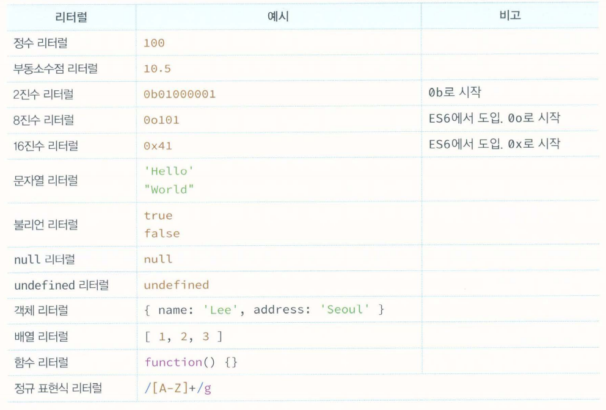

# 표현식과 문

지금까지 "값"이라는 용어가 자주 등장했다. "값"이라는 용어를 알고 있다고 생각하겠지만 막상 설명하려 하면 난감하지 않은가?!
- "개념을 이해한다는 것은 바로 용어를 정확히 이해하고 설명할 수 있다는 것이다."

## 값

- "값(value)은 식(표현식expression)이 평가(evaluate)되어 생성된 결과를 말한다.

모든 값은 데이터 타입을 가지며, 메모리에 2진수, 즉 비트의 나열로 저장된다.

예를 들어, 메모리에 저장된 값 0100 0001을 숫자로 해석하면 65지만 문자로 해석하면 'A'다.

변수는 "하나의 값"을 저장하기 위해 확보한 메모리 공간 자체 또는 그 메모리 공간을 식별하기 위해 붙인 이름이라고 했다. 따라서 변수에 할당되는 것이 값.

값은 다양한 방법으로 생성할 수 있다. 식으로 생성할 수도 있지만 가장 기본적인 방법은 리터럴을 사용하는 것이다.

## 리터럴

- "리터럴(literal)은 사람이 이해할 수 있는 문자 또는 약속된 기호를 사용해 값을 생성하는 표기법(notation)을 말한다."

사람이 이해할 수 있는 문자(아라비아 숫자,알파벳, 한글 등) 또는 미리 약속된 기호('', "", [], {}, // 등)로 표기한 코드다.

자바스크립트 엔진은 코드가 실행되는 시점인 런타임에 리터럴을 평가해 값을 생성한다.

"즉 리터럴은 값을 생성하기 위해 미리 약속한 표기법"

## 표현식

- "표현식(expression)은 값으로 평가될 수 있는 문(statement)이다. 즉 표현식이 평가되면 새로운 값을 생성하거나 기존값을 참조한다.

ex05_04~07까지 살펴보면 다양한 표현식이 있지만 값으로 평가된다는 점은 모두 동일하다. 즉,
- "값으로 평가될 수 있는 문은 모두 표현식이다."

표현식은 값으로 평가된다. 이 때 표현식과 표현식이 평가된 값은 동등한 관계, 즉 동치(equivalent)다. 예를 들어,
표현식 1 + 2는 평가되어 값 3을 생성하므로, 둘은 동치다.

따라서 표현식은 값처럼 사용할 수 있다.
이것을 문법적으로 값이 위치할 수 있는 자리에는 표현식도 위치할 수 있다는 것을 의미한다.

## 문

앞으로 자바스크립트를 설명할 때 "문(statement)과 "표현식(expression)"이라는 용어가 자주 등장할 것이다. 문과 표현식을 구별하고 해석할 수 있다면,
자바스크립트 엔진의 입장에서 코드를 읽을 수 있고 실행 결과를 예측하는 데 도움이 된다. 이는 버그를 줄이고 코드의 품질을 높여줄 것이다.

- "문은 프로그램을 구성하는 기본 단위이자 최소 실행 단위다."
문의 집합으로 이뤄진 것이 바로 프로그램이며, 문을 작성하고 순서에 맞게 나열하는 것이 프로그래밍이다. 문은 여러 토큰으로 구성된다.

- "토큰이란 문법적인 의미를 가지며, 문법적으로 더 이상 나눌 수 없는 코드의 기본 요소를 의미한다."
예를 들어, 키워드, 식별자, 연산자, 리터럴, 세미콜론(;)이나 마침표(.) 등의 특수 기호는 문법적인 의미를 가지며, 문법적으로 더이 상 나눌 수 없는 코드의 기본 요소이므로 모두 토큰이다.

## 세미콜론과 세미콜론 자동 삽입 기능

세미콜론(;)은 문의 종료를 나타낸다. 즉, 자바스크립트 엔진은 세미콜론으로 문이 종료한 위치를 순차적으로 하나씩 문을 실행한다.
따라서 문을 끝낼 때는 세미콜론을 붙여야 한다.

단, 0개 이상의 문을 중괄호로 묶은 코드 블록({...}) 뒤에는 세미콜론을 붙이지 않는다.

if문, for 문, 함수 등의 코드 블록 뒤에는 세미콜론을 붙이지 않는다. 이러한 코드 블록은 언제나 문의 종료를 의미하는 자체 종결성을 갖기 때문.

세미콜론은 생략 가능하다. 이는 자바스크립트 엔진이 소스코드를 해석 할 때 문의 끝이라고 예측되는 지점에 세미콜론을 자동으로 붙여주는"세미콜론 자동 삽입 기능(ASI)"이 암묵적으로 수행 되기 때문.

하지만 세미콜론 자동 삽입 기능의 동작과 개발자의 예측이 일치하지 않는 경우가 간혹 있다.(Ex05_10.js 참고)

세미콜론을 반드시 붙여야 한다는 주장이 다수를 차지하지만 붙이지 말아야 한다는 주장도 설득력이 있다. TC39도 세미콜론 사용을 권장하는 분위기이므로 세미콜론을 붙이자.

## 표현식인 문과 표현식이 아닌 문

표현식은 문의 일부일 수도 있고 그 자체로 문이 될 수도 있다.

표현식인 문은 값으로 평가 될 수 있는 문, 표현식이 아닌 문은 값으로 평가될 수 없는 문을 말한다.

표현식인 문과 표현식이 아닌 문을 구별하는 가장 간단하고 명료한 방법은 변수에 할당해 보는 것이다.

## 완료 값

크롬 개발자 도구에서 표현식이 아닌 문을 실행하면 언제나 undefined를 출력한다. 이를 완료 값이라 한다. 완료 값은 표현식의 평가 결과가 아니다. 따라서 다른 값과 같이 변수에 할당 할 수 없고 참조할 수도 없다.