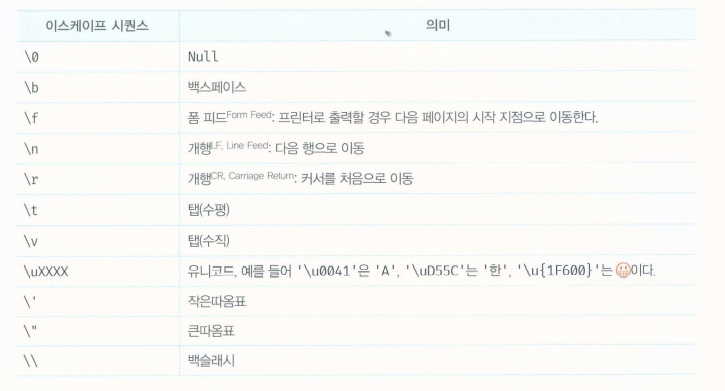

# 데이터 타입
데이터 타입은 값의 종류를 말한다. 자바스크립트의 모든 값은 데이터 타입을 갖는다.

ES6는 7개의 데이터 타입을 제공한다. 원시타입과 객체타입으로 분류할 수 있다.
- 숫자 타입 : 숫자, 정수와 실수 구분 없이 하나의 숫자타입만 존재
- 문자열 타입 : 문자열
- 불리언 타입 : 논리적 참(true)과 거짓(false)
- undefined 타입 : var 키워드로 선언된 변수에 암묵적으로 할당되는 값
- null 타입 : 값이 없다는 것을 의도적으로 명시할 때 사용하는 값
- 심벌 타입 : ES6에서 추가된 7번째 타입
- 객체 타입 : 객체, 함수, 배열 등

예를 들어 숫자 타입의 값 1과 문자열 타입의 값 '1'은 비슷해 보이지만 전혀 다른 값이다.

두 값은 생성한 목적과 용도가 다르다. 숫자 타입의 값은 주로 산술 연산을 위해 생성하지만, 문자열 타입의 값은 주로 텍스트를 출력하기 위해 생성한다.
확보해야 할 메모리 공간의 크기도 다르고 메모리에 저장되는 2진수도 다르며 읽어 들여 해석하는 방식도 다르다.

## 숫자 타입

C나 자바의 경우, 정수(소수점 이하가 없는 숫자)와 실수(소수점 이하가 있는 숫자)를 구분해서 int, long, float, double 등과 같은 다양한 숫자 타입을 제공한다. 하지만 자바스크립트는 독특하게 하나의 숫자 타입만 존재한다.

ECMAScript 사양에 따르면 숫자 타입의 값은 배정밀도 64비트 부동소수점 형식을 따른다. 즉 모든 수를 실수로 처리하며, 정수만 표현하기 위한 데이터 타입이 별도로 존재하지 않는다.

숫자 타입은 추가적으로 세 가지 특별한 값도 표현할 수 있다.
- Infinity : 양의 무한대
- -Infinity : 음의 무한대
- NaN : 산술 연산 불가(not-a-number)

## 문자열 타입

문자열 타입은 텍스트 데이터를 나타내는 데 사용한다.
작은따옴표(''), 큰따옴표("") 또는 백틱(``)으로 텍스트를 감싼다. 가장 일반적인 표기법은 작은따옴표를 사용.

## 템플릿 리터럴

ES6부터는 새로운 문자열 표기법인 템플릿 리터럴이 도입 되었다. 멀티라인 문자열, 표현식 삽입, 태그드 템플릿 등 편리한 문자열 처리 기능을 제공한다.

일반 문자열과 비슷해 보이지만 작은따옴표 또는 큰따옴표 같은 일반적인 따옴표 대신 백틱을 사용해 표현한다.

### 멀티라인 문자열

일반 문자열 내에서는 줄바꿈(개행)이 허용되지 않는다. 따라서 일반 문자열 내에서 줄바꿈 등의 공백을 표현하려면 백슬래시( \ )로 시작하는 이스케이프 시퀀스를 사용해야 한다.

예를 들어, 줄바꿈과 들여쓰기가 적용된 HTML 문자열은 다음과 같이 이스케이프 시퀀스를 사용해 작성한다. (ex06_10,11 참고)

### 표현식 삽입
문자열은 문자열 연산자 +를 사용해 연결할 수 있다. + 연산자는 피연산자 중 하나 이상이 문자열인 경우 문자열 연결 연산자로 동작한다. 그 외의 경우는 덧셈 연산자로 동작한다.

템플릿 리터럴 내에서는 표현식 삽입을 통해 더 간단히 문자열을 삽입할 수 있다. (Ex06_13,14참고)

템플릿 리터럴이 아닌 일반 문자열에서의 표현식 삽입은 문자열로 취급된다. (EX06_15 참고)

## 불리언 타입

불리언 타입의 값은 논리적 참, 거짓을 나타내는 true와 false 뿐이다.

## undefined 타입
undefined 타입의 값은 undefined가 유일하다.
var 키워드로 선언한 변수는 암묵적으로 undefined로  초기화된다. 다시 말해, 변수 선언에 의해 확보된 메모리 공간을 처음 할당이 이뤄질 때 까지 빈 상태(대부분 garbage value가 들어 있다.)로 내버려두지 않고 엔진이 undefined로 초기화한다.
따라서 변수를 선언만 해놓고 값을 할당 안하면 undefined가 반환된다.

### 선언과 정의
undefined를 직역하면 "정의되지 않은"이다. 자바스크립트의 undefined에서 말하는 정의란 변수에 값을 할당하여 변수의 실체를 명확히 하는 것을 말한다.
자바스크립트의 경우 변수를 선언하면 암묵적으로 정의가 이뤄지기 때문에 선언과 정의이 구분이 모호하다. 
ECMAScript 사양에서 변수는 '선언한다'라고 표현하고, 함수는 '정의한다'라고 표현한다

## null 타입

null 타입의 값은 null이 유일하다. 자바스크립트는 대소문자를 구별하므로 null은 Null, NULL등과 다르다.

## 심벌 타입

심벌은 ES6에서 추가된 7번째 타입으로, 변경 불가능한 원시 타입의 값이다. 심벌 값은 다른 값과 중복되지 않는 유일무이한 값이다. 따라서 주로 이름이 충돌할 위험이 없는 객체의 유일한 프로퍼티 키를 만들기 위해 사용한다.(Ex06_20 참고)

## 객체 타입

자바스크립트의 데이터 타입은 크게 원시 타입과 객체 타입으로 분류한다고 했다. 그 이유는 원시 타입과 객체 타입이 근본적으로 다르다는 의미 일 것이다.
자바스크립트는 객체 기반의 언어이며, 
- "자바스크립트를 이루고 있는 거의 모든 것이 객체"
라는 것이 중요한 것.

지금까지 살펴본 6가지 데이터 타입 이외의 값은 모두 객체 타입이다.

## 데이터 타입의 필요성

### 데이터 타입에 의한 메모리 공간의 확보와 참조

값은 메모리에 저장하고 참조할 수 있어야 한다. 몇 바이트의 메모리 공간을 사용해야 낭비와 손실 없이 값을 저장할 수 있는지 알아야 한다.

자바스크립트 엔진은 데이터 타입, 즉 값의 종류에 따라 정해진 크기의 메모리 공간을 확보한다.
즉, 변수에 할당되는 값의 데이터 타입에 따라 확보해야 할 메모리 공간의 크기가 결정된다.

예제 06_21의 경우 자바스크립트 엔진은 리터럴 100을 숫자 타입의 값으로 해석하고 100을 저장하기 위해 8바이트의 메모리 공간을 확보한다. 그리고 100을 2진수로 저장한다.

그렇다면 컴퓨터는 어떻게 한 번에 읽어야 할 메모리 셀의 크기를 알 수 있는 걸까? score 변수에는 숫자 타입의 값이 할당되어 있으므로 자바스크립트 엔진은 score 변수를 숫자 타입으로 인식한다.

### 데이터 타입에 따라 확보되는 메모리 공간의 크기
ECMAScript 사양은 문자열과 숫자 타입 외의 데이터 타입의 크기를 명시적으로 규정하고 있지 않다. 따라서 문자열과 숫자 타입을 제외하고 데이터 타입에 따라 확보되는 메모리 공간의 크기는 자바스크립트 엔진 제조사의 구현에 따라 다를 수 있다.

### 데이터 타입에 의한 값의 해석

그런데 아직 문제가 남았다. 메모리에서 읽어 들인 2진수를 어떻게 해석해야 하느냐다.

모든 값은 데이터 타입을 가지며, 메모리에 2진수, 즉 비트의 나열로 저장된다. 메모리에 저장된 값은 데이터 타입에 따라 다르게 해석될 수 있다. 예를 들어, 메모리에 저장된 값 0100 0001을 숫자로 해석하면 65지만 문자열로 해석하면 'A'다.

지금까지 살펴본 데이터 타입에 대해 정리해보자. 데이터 타입은 값의 종류를 말한다. 자바스크립트의 모든 값은 데이터 타입을 갖는다.
데이터 타입이 필요한 이유는 다음과 같다.
- 값을 저장할 때 확보해야 하는 "메모리 공간의 크기"를 결정하기 위해
- 값을 참조할 때 한 번에 읽어 들여야 할 "메모리 공간의 크기"를 결정하기 위해
- 메모리에서 읽어 들인 "2진수를 어떻게 해석"할지 결정하기 위해

## 동적 타이핑

### 동적 타입 언어와 정적 타입 언어
자바스크립트의 모든 값은 데이터 타입을 갖는다고 했다. 그렇다면 변수는?

C나 자바 같은 정적 타입 언어(static/Strong type)는 변수를 선언할 때 변수에 할당할 수 있는 값의 종류, 즉
데이터 타입을 사전에 선언해야 한다. 이를 명시적 타입 선언(explicit type declaration)이라 한다.

정적 타입 언어는 변수의 타입을 변경할 수 없으며, 컴파일 시점에 타입체크(선언한 데이터 타입에 맞는 값을 할당했는지 검사)를 수행한다.
만약 타입 체크를 통과하지 못하면, 에러를 발생시켜서 실행 자체를 막는다.
이를 통해 타입의 일관성을 강제함으로 더욱 안정적인 코드의 구현을 통해 런타임에 발생하는 에러를 줄인다.

자바스크립트는 정적 타입 언어와 다르게 변수를 선언할 때 타입을 선언하지 않는다.

자바스크립트의 변수는 정적 타입 언어와 같이 미리 선언한 데이터 타입의 값만 할당할 수 있는 것이 아닌, 어떠한 데이터 타입의 값이라도 자유롭게 할당할 수 있다. (ex06_23 참고)

- "자바스크립트의 변수는 선언이 아닌 할당에 의해 타입이 결정(type infernece)된다. 그리고 재할당에 의해 변수의 타입은 언제든지 동적으로 변할 수 있다. 이러한 특징을 동적 타이핑(dynamic type)이라 하며, 정적 타입 언어와 구별하기 위해 동적 타입 언어라 한다."

### 동적 타입 언어와 변수

어떠한 데이터 타입의 값이라도 자유롭게 할당할 수 있는, 동적 타입 언어의 특징은 데이터 타입에 대해 무감각해질 정도로 편리하다.하지만 편리함의 이면에는 위험도 도사리고 있다.
모든 소프트웨어 아키텍처에는 트레이드오프가 존재하며, 모든 어플리케이션에 적합한 명쾌한 해결책은 없듯이 동적 타입 언어 또한 구조적인 단점이 있다.

복잡한 프로그램에서는 변화하는 변수 값을 추적하기 어려울 수 있고, 값의 변경에 의해 타입도 언제든지 변경 될 수 있다. 따라서 동적 타입 언어의 변수는 값을 확인하기 전에는 타입을 확신할 수 없다.

결국 동적 타입 언어는 유연성은 높지만 신뢰성은 떨어진다.

따라서 변수를 사용할 때의 주의할 사항은 다음과 같다.

- 변수는 꼭 필요한 경우에 한해 제한적으로 사용한다. 필요한 만큼 최소한으로 유지하도록 주의해야 한다.
- 변수의 유효범위(스코프)는 최대한 좁게 만들어 변수의 부작용을 억제해야 한다. 변수의 유효 범위가 넓으면 넓을수록 변수로 인해 오류가 발생할 확률이 높아진다.
- 전역 변수는 최대한 사용하지 않도록 한다. 어디서든지 참조/변경 가능한 전역 변수는 의도치 않게 값이 변경될 가능성이 높고 다른 코드에 영향을 줄 가능성도 높다. 프로그램의 복잡성을 증가시키고, 처리 흐름을 추적하기 어렵게 만들고, 오류가 발생할 경우 오류의 원인을 특정하기 어렵게 만든다.
- 변수보다는 상수를 사용해 값의 변경을 억제한다.
- 변수 이름은 변수의 목적이나 의미를 파악할 수 있도록 네이밍한다. 변수 이름뿐 아닌 모든 식별자는 존재 이유를 파악할 수 있는 적절한 이름으로 지어야 한다. 유효 범위가 넓을 수록 명확한 이름을 명명하도록 노력하자. 명확한 네이밍은 코드를 이해하기 쉽게 만들고, 이는 협업과 생산성 향상에 도움을 준다.

코드는 개발자를 위한 문서이다. 사람이 이해할 수 있는 코드. 즉,
- "가독성이 좋은 코드가 좋은 코드다."