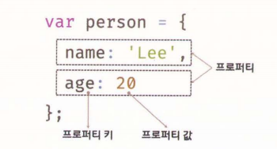
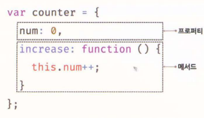

# 객체란?

자바스크립트는 객체 기반의 프로그래밍 언어이며, 구성하는 거의 "모든 것"이 객체다. 원시값을 제외한 나머지 값은 모두 객체.

- "원시 타입의 값, 즉 원시 값은 변경 불가능한 값이지만 객체 타입의 값, 즉 객체는 변경 가능한 값"이다.

객체는 0개 이상의 프로퍼티로 구성된 집합이며, 프로퍼티는 키와 값으로 구성된다.

자바스크립트에서 사용할 수 있는 모든 값은 프로퍼티 값이 될 수 있다. 자바스크립트의 함수는 일급 객체이므로 값으로 취급할 수 있다. 따라서 함수도 프로퍼티 값으로 사용할 수 있다. 프로퍼티 값이 함수일 경우, 일반 함수와 구분하기 위해 메서드라 부른다.

객체는 프로퍼티와 메서드로 구성된 집합체이다. 프로퍼티와 메서드의 역할은 다음과 같다.

- 프로퍼티 : 객체의 상태를 나타내는 값 (data)
- 메서드 : 프로퍼티(상태 데이터)를 참조하고 조작할 수 있는 동작(behavior)

이처럼 객체는 객체의 상태를 나타내는 값(프로퍼티)과 프로퍼티를 참조하고 조작할 수 있는 동작(메서드) 모두 포함할 수 있기 때문에 상태와 동작을 하나의 단위로 구조화할 수 있어 유용하다.

객체의 집합으로 프로그램을 표현하려는 프로그래밍 패러다임을 객체지향 프로그래밍이라 한다. 객체지향 프로그래밍에 대해서는 19.1절 "객체지향 프로그래밍"에서 자세히 살펴보자.

### 객체와 함수

자바스크립트의 객체는 함수와 밀접한 관계를 가진다. 함수로 객체를 생성하기도 하며 함수 자체가 객체이기도 하다.
자바스크립트에서 함수와 객체는 분리해서 생각할 수 없는 개념이다. 즉, 객체를 이해해야 함수를 제대로 이해할 수 있고, 반대로 함수를 이해해야 객체를 정확히 이해할 수 있다.

따라서 객체와 함수를 분리해서 설명하는 것은 옳지 않다. 프로그래밍 언어 자체는 순서가 없고 서로 물고 물리는 순환 구조가 있어, 잘 이해되지 않는 개념이 나오면 멈추지말고 일단은 다음으로 넘어가는 것도 방법.

## 객체 리터럴에 의한 객체 생성

C++나 자바 같은 클래스 기반 객체지향 언어는 클래스를 사전에 정의하고 필요한 시점에 new 연산자와 함께 생성자를 호출하여 인스턴스를 생성하는 방식으로 객체를 생성한다.

자바스크립트는 프로토타입 기반 객체지향 언어로서 클래스 기반 객체지향 언어와는 달리 다양한 객체 생성 방법을 지원한다.

- 객체 리터럴
- Object 생성자 함수
- 생성자 함수
- Object.create 메서드
- 클래스 (ES6)

이러한 객체 생성 방법 중에서 가장 일반적이고 간단한 방법은 객체 리터럴을 사용하는 방법이다.

객체 리터럴은 중괄호 내에 0개 이상의 프로퍼티를 정의한다. 변수에 할당되는 시점에 자바스크립트엔진은 객체 리터럴을 해석해 객체를 생성한다.(Ex10_01 참고)

만약 중괄호 내에 프로퍼티를 정의하지 않으면 빈 객체가 생성된다. (Ex10_02 참고)

객체 리터럴의 중괄호는 코드 블록을 의미하지 않는다는 데 주의하자. 코드 블록의 닫는 중괄호 뒤에는 세미콜론을 붙이지 않지만, 객체 리터럴의 닫는 중괄호 뒤에는 세미콜론을 붙인다.

## 프로퍼티

객체는 프로퍼티의 집합이며, 프로퍼티는 키와 값으로 구성된다.(Ex10_03 참고)

프로퍼티를 나열할 때는 쉼표(,)로 구분하고 마지막에는 사용하지 않으나 사용해도 무방하다.

프로퍼티 키와 값으로 사용할 수 있는 값은 다음과 같다.

- 프로퍼티 키 : 빈 문자열을 포함하는 모든 문자열 또는 심벌 값
- 프로퍼티 값 : 자바스크립트에서 사용할 수 있는 모든 값

반드시 식별자 네이밍규칙을 따라야 하는 것은 아니지만 규칙을 준수하는 키와 그렇지 않은 키는 미묘한 차이가 있음.

심벌 값도 프로퍼티 키로 사용할 수 있지만 일반적으로 문자열을 사용한다. 이 때 프로퍼티 키는 문자열이므로 따옴표로 묶어야 하지만 식별자 네이밍 규칙을 준수하는 이름, 자바스크립트에서 사용 가능한 유효한 이름인 경우 따옴표를 생략할 수 있다. 반대로 말하면
- "식별자 네이밍 규칙을 따르지 않는 이름에는 반드시 따옴표를 사용해야 한다."

식별자 네이밍 규칙을 다르지 않는 프로퍼티 키를 사용하면 번거로운 일을 만들 수 있기 때문에 가급적 준수하는 키를 사용하자.(Ex10_04 참고)

프로퍼티 키로 사용한 firstName은 식별자 네이밍 규칙을 준수한다. 하지만 last-name은 식별자 네이밍 규칙을 준수하지 않는다. 따라서 따옴표를 생략할 수 없다.(Ex10_05 참고)

문자열 또는 문자열로 평가활 수 있는 표현식을 사용해 프로퍼티 키를 동적으로 생성할 수도 있다. 이 경우에는 프로퍼티 키로 사용할 표현식을 대괄호([...])로 묶어야 한다.(Ex10_06 참고)

프로퍼티 키에 문자열이나 심벌 값 외의 값을 사용하면 암묵적 타입 변환을 통해 문자열이 된다. 예를 들어, 프로퍼티 키로 숫자 리터럴을 사용하면 따옴표는 붙지 않지만 내부적으로 문자열로 변환 된다.(Ex10_08 참고)

## 메서드

자바스크립트에서 사용할 수 있는 모든 값은 프로퍼티 값으로 사용할 수 있다고 했다. 아직 살펴보지 않았지만 자바스크립트의 함수는 객체(일급객체)다.
따라서 함수는 값으로 취급할 수 있기 때문에 프로퍼티 값으로 사용할 수 있다.
프로퍼티 값이 함수일 경우 일반 함수와 구분하기 위해 메서드라 부른다. 즉, 메서드는 객체에 묶여있는 함수를 의미한다.(Ex10_11 참고) 

## 프로퍼티 접근

프로퍼티에 접근하는 방법은 두 가지.

- 마침표 프로퍼티 접근 전산자(.)를 사용하는 마침표 표기법
- 대괄호 프로퍼티 접근 연산자([...])를 사용하는 대괄호 표기법(Ex10_12 참고)

대괄호 표기법을 사용하는 경우
- "대괄호 프로퍼티 접근 연산자 내부에 지정하는 프로퍼티 키는 반드시 따옴표로 감싼 문자열"이어야한다.
(Ex10_13 참고)

- "객체에 존재하지 않는 프로퍼티에 접근하면 undefined를 반환한다." 
이때 ReferenceError가 발생하지 않는다.(Ex10_14 참고)

프로퍼티 키가 식별자 네이밍 규칙을 준수하지 않는 이름이라면 반드시 대괄호 표기법을 사용해야 한다.
단, 프로퍼티 키가 숫자로 이뤄진 문자열인 경우 따옴표를 생략할 수 있다. 그 외의 경우 대괄호 내에 들어가는 프로퍼티 키는 반드시 따옴표로 감싼 문자열이어야 한다. (Ex10_15 참고)

## 프로퍼티 값 갱신

이미 존재하는 프로퍼티에 값을 할당하면 프로퍼티 값이 갱신된다. (Ex10_16 참고)

## 프로퍼티 동적 생성

존재하지 않는 프로퍼티에 값을 할당하면 프로퍼티가 동적으로 생성되어 추가되고 프로퍼티 값이 할당된다.(Ex10_17 참고)

## 프로퍼티 삭제

delete 연산자는 객체의 프로퍼티를 삭제한다. 이때 delete 연산자의 피연산자는 프로퍼티 값에 접근할 수 있는 표현식이어야 한다. 만약 존재하지 않는 프로퍼티를 삭제하면 아무런 에러 없이 무시된다.(Ex10_18 참고)

## ES6에서 추가된 객체 리터럴의 확장 기능

Es6에서는 더욱 간편하고 표현력 있는 객체 리터럴의 확장 기능을 제공한다.

### 프로퍼티 축약 표현

객체 리터럴의 프로퍼티는 프로퍼티 키와 값으로 구성된다. 프로퍼티 값은 변수에 할당된 값 즉 식별자 표현식일 수도 있다. (Ex10_19)

ES6에서는 프로퍼티 값으로 변수를 사용하는 경우 변수 이름과 프로퍼티 키가 동일한 이름 일 때 생략할 수 있다. 프로퍼티 키는 변수 이름으로 자동 생성 된다.(Ex10_20)

### 계산된 프로퍼티 이름

문자열 또는 문자열로 타입 변환할 수 있는 값으로 평가되는 표현식을 사용해 프로퍼티 키를 동적으로 생성할 수도 있다. 단 프로퍼티 키로 사용할 표현식을 대괄호로 묶어야 한다. 이를 계산된 프로퍼티 이름이라 한다.

ES5에서 계산된 프로퍼티 이름으로 프로퍼티 키를 동적 생성하려면 객체 리터럴 외부에서 대괄호([])로 표기법을 사용해야 한다.(Ex10_21)

Es6에서는 객체 리터럴 내부에서도 계산된 프로퍼티 이름으로 프로퍼티 키를 동적 생성할 수 있다(Ex10_22)

## 메서드 축약 표현
Es5에서 메서드를 정의하려면 프로퍼티 값으로 함수를 할당한다. (Ex10_23)

Es6에서는 메서드를 정의할 때 function 키워드를 생략한 축약 표현을 사용할 수 있다. (Ex10_24)