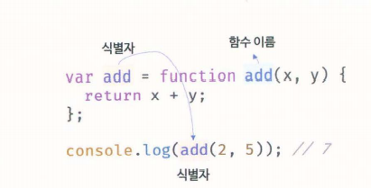

# 함수

## 함수란?

함수는 자바스크립트에서 가장 중요한 핵심 개념이다.

프로그래밍 언어의 함수는 수학의 함수와 같은 개념이다.

함수 f(x,y) = x + y를 자바스크립트의 함수로 표현해보자. (Ex12_01)

프로그래밍 언어의 함수는 일련의 과정을 문으로 구현하고 코드 블록으로 감싸서 하나의 실행 단위로 정의한 것이다.

입력을 받아서 출력을 내보내는 것 = 함수.

이 때 함수 내부로 입력을 전달받는 변수를 매개 변수, 입력을 인수, 출력을 반환값이라 한다.

또한 함수는 여러 개 존재할 수 있는 값이므로 식별자인 함수 이름을 사용할 수 있다.

함수는 함수 정의를 통해 생성한다.
- 함수 선언문을 통해 함수를 정의한 예(Ex12_02)

함수 정의만으로 함수가 실행되는 것은 아니다. 정의된 일련의 과정을 실행하기 위해 필요한 입력 즉 인수를 매개변수를 통해 함수에 전달하면서 함수의 실행을 명시적으로 지시 해야한다. 이를 "함수 호출"이라 한다. (Ex12_03)

## 함수를 사용하는 이유

함수는 필요할 때 여러 번 호출할 수 있다. 실행 시점을 개발자가 결정할 수 있고, 몇 번이든 재사용이 가능 하다는 것. "코드의 재사용"이라는 측면에서 매우 유용하다.

코드의 중복을 억제하고 재사용성을 높이는 함수는 "유지보수의 편의성"을 높이고 실수를 줄여 "코드의 신뢰성"을 높이는 효과가 있다.

함수는 객체 타입의 값이다. 따라서 이름을 붙일 수 있어서, 적절하게 함수 이름을 붙이면 내부 코드를 이해하지 않고도 역할을 파악할 수 있다. "코드의 가독성"을 향상 시킨다.

## 함수 리터럴

자바스크립트의 함수는 객체 타입의 값이다. 따라서 숫자 값을 숫자 리터럴로 생성하고 객체를 객체 리터럴로 생성하는 것처럼 함수도 함수 리터럴로 생성할 수 있다.
function 키워드, 함수 이름, 매개 변수 목록, 함수 몸체로 구성된다.(Ex 12_04)

함수 리터럴의 구성 요소는 다음과 같다.

1. 함수 이름
- 함수이름은 식별자다. 따라서 식별자 네이밍 규칙을 준수해야 한다.
- 함수 이름은 함수 몸체 내에서만 참조할 수 있는 식별자다.
- 함수 이름은 생략할 수 있따. 이름이 있는 함수를 "기명함수" 없는 함수를 "무명/익명함수"라 한다

2. 매개변수 목록
- 0개 이상의 매개변수를 소괄호로 감싸고 쉼표로 구분한다.
- 각 매개변수에는 함수를 호출할 때 지정한 인수가 순서대로 할당된다. 즉 매개변수 목록은 순서에 의미가 있다.
- 매개변수는 함수 몸체 내에서 변수와 동일하게 취급된다.

3. 함수 몸체
- 함수가 호출되었을 때 일괄적으로 실행될 문들을 하나의 실행 단위로 정의한 코드 블록이다.
- 함수 몸체는 함수 호출에 의해 실행된다.

리터럴은 값을 생성하기 위한 표기법이며, 함수 리터럴도 평가되어 값을 생성한다. 이 값은 객체이니까 함수는 객체다.

함수는 객체지만 일반 객체와 다른 점은 일반 객체는 호출할 수 없지만 함수는 호출할 수 있다. 그리고 일반 객체에 없는 함수 객체만의 고유한 프로퍼티를 갖는다.

## 함수 정의

함수를 정의하는 방법에는 4가지가 있다

- 함수 선언문
- 함수 표현식
- Function 생성자 함수
- 화살표 함수(ES6)

모든 함수 정의 방식은 함수를 정의한다는 면에서는 동일하지만 미묘하게 중요한 차이가 있다.

### 함수 선언문

함수 선언문은 함수 리터럴과 형태가 동일하다. 단 함수 리터럴은 함수 이름을 생략할 수 있으나 함수 선언문은 함수 이름을 생략할 수 없다.(Ex12_05,06)

함수 선언문은 표현식이 아닌 문이다 크롬 개발자 도구에서 실행하면 완료값 undefined가 출력된다.
함수 선언문이 만약 표현식인 문이라면 완료 값 undefined 대신 표현식이 평가되어 생성된 함수가 출력되어야 한다.

표현식이 아닌 문은 변수에 할당할 수 없다. 함수 선언문도 표현식이 아닌 문이므로 변수에 할당 할 수 없다. 근데 함수 선언문이 변수에 할당되는 것처럼 보이는 경우가 있다. (Ex12_07)

자바스크립트 엔진이 코드의 문맥에 따라 함수리터럴을 표현식이 아닌 문인 함수 선언문으로 해석하는 경우와 표현식인 문인 함수 리터럴 표현식으로 해석하는 경우가 있기 때문이다.

{ }은 블록문일 수도 있고, 객체 리터럴일 수도 있다.
{ }은 중의적 표현이다 자바스크립트 엔진은 중의적인 코드를 문맥에 따라 해석을 다르게 한다. 동일한 코드도 코드의 문맥에 따라 해석이 달라질 수 있다.

기명 함수 리터럴도 중의적인 코드다 따라서 코드의 문맥에 따라 해석이 달라질 수 있다.(Ex12_08)

예제에서 함수 선언문으로 생성된 foo는 호출할 수 있으나 bar는 호출할 수 없다.

그 이유는 함수 몸체 외부에서는 함수 이름으로 함수를 참조할 수 없기 때문에, 함수를 가리키는 식별자가 없다는 것이기 때문에 bar함수가 호출되지 않은것.

근데 foo는? 위 예제에서는 식별자 foo를 선언한적도 없고 할당한 적도 없는데..?? 

답은 자바스크립트 엔진이 암묵적으로 생성한 식별자.

- "자바스크립트 엔진은 생성된 함수를 호출하기 위해 함수 이름과 동일한 이름의 식별자를 암묵적으로 생성하고 거기에 함수 객체를 할당한다."

지금까지 살펴본 함수 선언문을 의사코드로 표현하면 Ex12_09와 같다.

함수는 함수 이름으로 호출하는 것이 아니라 함수 객체를 가리키는 식별자로 호출한다. 즉 함수 선언문으로 생성한 함수를 호출한 것은 함수 이름 add가 아니라 자바스크립트 엔진이 암묵적으로 생성한 식별자 add 인 것.

"함수 이름과 변수 이름이 일치하니까 함수 이름으로 호출되는듯 하지만 사실은 식별자로 호출된 것이다."

### 함수 표현식

함수는 값처럼 변수에 할당 할 수도 있고 프로퍼티 값이 될 수도 있으며 배열의 요소가 될 수도 있다. 이처럼 값의 성질을 갖는 객체를 "일급 객체"라 한다. "자바스크립트의 함수는 일급 객체"다.

함수 표현식의 함수 리터럴은 함수 이름을 생략하는 것이 일반적이다.

함수 선언문에서 살펴본 바와 같이 함수를 호출할 때는 함수 이름이 아니라 객체를 가리키는 식별자를 사용해야 한다. 함수 이름은 몸체 내부에서만 유효한 식별자이므로 함수 이름으로 호출할 수 없다.

자바스크립트엔진은 함수 선언문의 함수 이름으로 식별자를 암묵적 생성하고 생성된 함수 객체를 할당하므로 함수 표현식과 유사하게 동작하는 것처럼 보인다. 하지만 함수 선언문과 함수 표현식이 정확히 동일하게 동작하지는 않는다.

함수 선언문은 "표현식이 아닌 문"이고 함수 표현식은 " 표현식인 문"이다. 따라서 미묘하지만 중요한 차이가 있다.

### 함수 생성 시점과 함수 호이스팅

Ex12_12와 같이 함수 선언문으로 정의한 함수는 선언문 이전에 호출할 수 있다. 하지만 함수 표현식으로 정의한 함수는 표현식 이전에 호출할 수 없다. 이는

- "함수 선언문으로 정의한 함수와 함수 표현식으로 정의한 함수의 생성 시점이 다르기 때문이다."

- "함수 선언문이 코드의 선두로 끌어 올려진 것처럼 동작하는 자바스크립트 고유의 특징을 함수 호이스팅이라 한다."

- "변수 할당문의 값은 할당문이 실행되는 시점, 즉 런타임에 평가되므로 함수 표현식의 함수 리터럴도 할당문이 실행되는 시점에 평가되어 함수 객체가 된다.

- "함수 표현식으로 함수를 정의하면 함수 호이스팅이 발생하는 것이 아니라 변수 호이스팅이 발생한다.

함수 호이스팅은 함수를 호출하기 전에 반드시 함수를 선언해야 한다는 당연한 규칙을 무시한다 이같은 문제 때문에 JSON을 창안한 더글라스 크락포드는 함수 선언문 대신 "함수 표현식"을 사용할 것을 권장한다.

### Function 생성자 함수

자바스크립트가 기본 제공하는 빌트인 함수인 Function 생성자 함수에 매개변수 목록과 함수 몸체를 문자열로 전달하면서, new 연산자와 함께 호출하면 함수 객체를 생성해서 반환한다. 사실 new 연산자가 없어도 된다.

생성자 함수는 객체를 생성하는 함수를 말한다 객체를 생성하느 방식은 객체 리터럴 이외에 다양한 방법이 있다.

Function 생성자 함수로 지금까지 살펴본 add 함수를 생성해 보자(Ex12_13)

Function 생성자 함수로 함수를 생성하는 방식은 일반적이지 않으며 바람직 하지도 않다. 함수 선언문이나 함수 표현식으로 생성한 함수와 다르게 동작한다.

### 화살표 함수

ES6에서 도입된 화살표 함수는 function 키워드 대신 화살표 =>를 사용해 좀 더 간략한 방법으로 함수를 선언할 수 있다. 항상 익명 함수로 정의한다.(Ex12_15)

화살표 함수는 생성자 함수로 사용할 수 없으며, 기존 함수와 this 바인딩 방식이 다르고, prototype 프로퍼티가 없으며 arguments 객체를 생성하지 않는다.

## 함수 호출

함수는 함수를 가리키는 식별자와 한 쌍의 소괄호인 함수 호출 연산자로 호출한다. 함수 호출 연산자 내에는 0개 이상의 인수를 쉼표로 구분해서 나열한다. 함수를

### 매개변수와 인수

함수를 실행하기 위해 필요한 값을 함수 외부에서 함수 내부로 전달할 필요가 있는 경우, 매개변수(인자)를 통해 인수를 전달한다. 인수는 값으로 평가될 수 있는 표현식이어야 한다. 인수는 함수를 호출할 때 지정하며, 개수와 타입에 제한이 없다(Ex12_16)

매개변수는 함수를 정의할 때 선언하며, 함수 몸체 내부에서 변수와 동일하게 취급된다. 즉, 함수가 호출되면 함수 몸체 내에서 암묵적으로 매개변수가 생성되고 undefined로 초기화 된 후 인수가 순서대로 할당된다.
매개변수는 함수 몸체 내부에서만 참조할 수 있고 함수 몸체 외부에서는 참조할 수 없다. 즉 매개변수의 스코프는 함수 내부다.(Ex12_17)

인수가 부족해서 인수가 할당되지 않은 매개변수의 값은 undefined다.(Ex12_18,19)

arguments 객체는 함수를 정의할 때 매개변수 개수를 확정할 수 없는 가변 인자 함수를 구현할 때 사용된다.(Ex12_20)

### 인수 확인

(Ex12_21) 를 살펴보면

함수를 정의한 개발자의 의도는 아마도 2개의 숫자 타입 인수를 전달받아 그 합계를 반환하려는 것으로 추측된다.
하지만 코드 상으로 어떤 타입의 인수를 전달해야 하는지 어떤 타입의 값을 반환하는지 명확하지 않다.

하지만 문법상 어떠한 문제도 없기 때문에 자바스크립트 엔진은 아무런 이의 제기없이 위 코드를 실행한다. 이러한 상황이 발생한 이유는 다음과 같다.

1. 자바스크립트 함수는 매개변수와 인수의 개수가 일치하는지 확인하지 않는다.
2. 자바스크립트는 동적 타입 언어다. 따라서 자바스크립트 함수는 매개변수의 타입을 사전에 지정할 수 없다.

그렇기 때문에 함수를 정의할 때는 적절한 인수가 전달되었는지 확인할 필요가 있다.(Ex12_23)

arguements 객체를 통해 인수 개수를 확인 할 수도 있따. 또는 인수가 전달되지 않은 경우 단축 평가를 사용해 매개변수에 기본값을 할당하는 법도 있다.(Ex12_24,25)

### 매개변수의 최대 갯수

함수의 매개변수는 코드를 이해하는 데 방해 요소이므로 이상적인 매개변수 개수는 0개, 적을수록 좋다.
- "이상적인 함수는 한가지 일만해야 하며 가급적 작게 만들어야 한다."

다음은 jQuery의 ajax 메서드에 객체를 인수로 전달하는 예다.(Ex12_26)

객체를 인수로 사용하는 경우 프로퍼티 키만 정확히 지정하면 매개변수의 순서를 신경쓰지않아도 된다.

### 반환문

함수는 return 키워드와 표현식(반환값)으로 이뤄진 반환문을 사용해 실행 결과를 함수 외부로 반환(return) 할 수 있다.(Ex12_27)

multiply 함수는 두 개의 인수를 전달받아 곱한 결과값을 return 키워드를 사용해 반환한다.
"함수 호출은 표헌식" 이다. return 키워드가 반환한 표현식의 평가결과, 즉 반환값으로 평가된다.

반환문은 두가지 역할을 한다.
1. 반환문은 함수의 실행을 중단하고 함수 몸체를 빠져나간다. 따라서 반환문 이후에 다른 문이 존재하면 그 문은 실행되지 않고 무시된다.
2. 반환문은 return 키워드에 오는 표현식을 평가해 반환한다. return 키워드 뒤에 반환값으로 사용할 표현식을 명시적으 로 지정하지 않으면 undefined가 반환된다.

## 참조에 의한 전달과 외부 상태의 변경

함수를 호출하면서 매개변수에 값을 전달하는 방식을 값에 의한 호출, 참조에 의한 호출로 구별해 부르는 경우도 있으나, 동작 방식은 값에 의한 전달, 참조에 의한 전달과 동일하다. (Ex12_33)

## 다양한 함수의 형태

### 즉시 실행 함수

(Ex 12_34~42)

### 재귀 함수

함수가 자기 자신을 호출하는 것을 재귀 호출이라 한다. 재귀함수는 자기 자신을 호출하는 행위 즉 재귀 호출을 수행하는 함수를 말한다.
(Ex12-43~47)

재귀 함수는 자신을 무한 재귀 호출한다 따라서 재귀 함수 내에는 멈출 수 있는 탈출조건을 반드시 만들어야 한다.

### 중첩 함수

함수 내부에 정의된 함수를 중첩함수 또는 내부 함수라 한다.

그리고 중첩 함수를 포함하는 함수는 외부 함수라 부른다. 중첩함수는 외부 함수 내부에서만 호출 할 수 있다.
일반적으로 중첩함수는 자신을 포함하는 외부 함수를 돕는 헬퍼 함수의 역할을 한다. (Ex12_48)

ES6부터 함수 정의는 문이 위치할 수 있는 문맥이면 어디든지 가능하다.

단, 호이스팅으로 인해 혼란이 발생할 수 있으니, 코드 블록에서 함수 선언문을 통해 함수를 정의하는 것은 바람직하지 않다.

### 콜백 함수

어떤 일을 반복 수행하는 repeat 함수를 정의해 보자.
(Ex12_49~55)

### 순수함수와 비순수 함수

동일한 인수가 전달되면 언제나 동일한 값을 반환하는 순수 함수(Ex12_56)

반대로 외부 상태에 따라 반환값이 달라지는 함수 비순수 함수(Ex12_57)